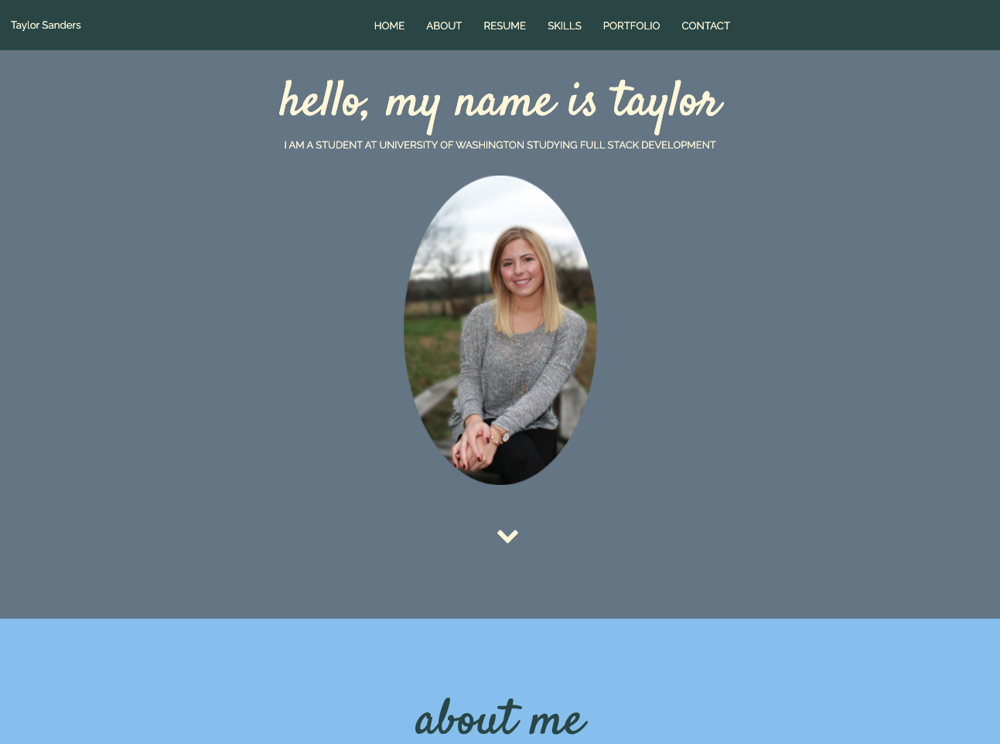
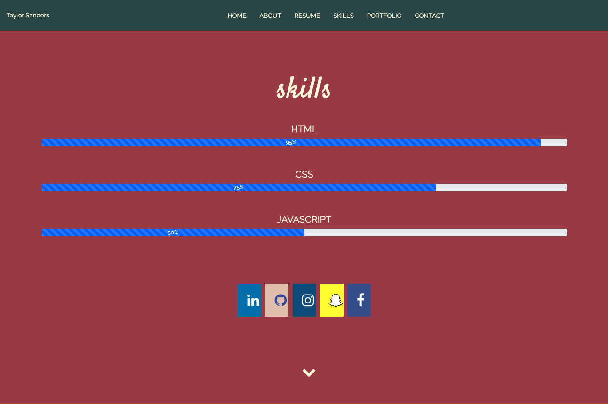
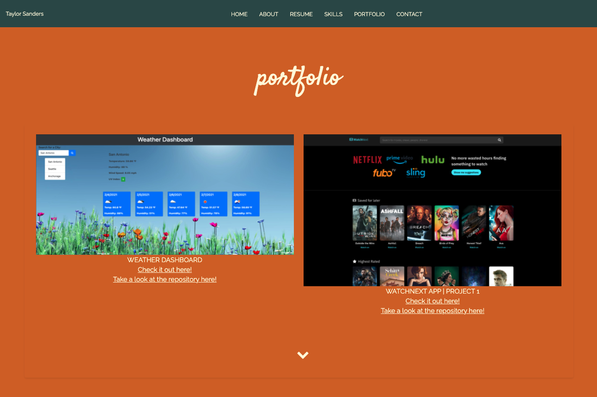
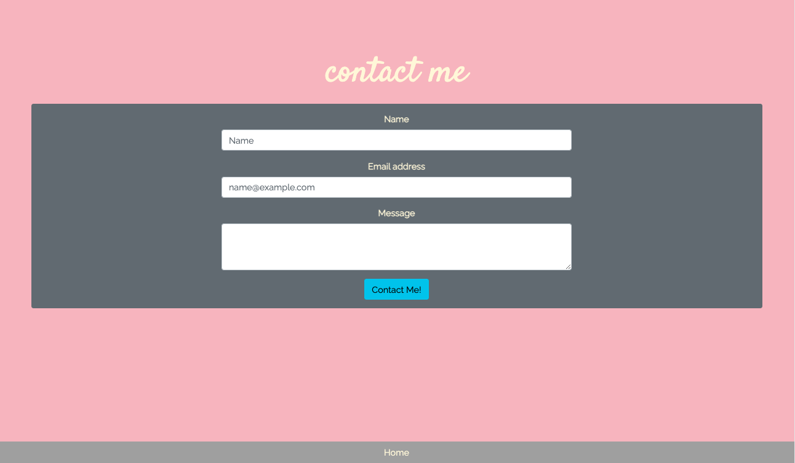

# interactive-resume

Updated portfolio with examples from Homework assignments and Group Project #1


<br><br>

## Built using Javascript, Html, and CSS. This application showcases some of my skills learned during my coding bootcamp on Github. A resume is included, and can be downloaded as a pdf.

### Built with

* [HTML](https://www.w3schools.com/)
* [CSS](https://www.w3schools.com/)
* [Bootstrap](https://getbootstrap.com/docs/4.3/getting-started/introduction/)
* [Javascript](https://www.w3schools.com/)
* [FontAwesome](https://fontawesome.com/)
<br><br>


<!-- GETTING STARTED -->
## Getting Started

To get a local copy up and running follow these steps. You can also download the source files provided. You will need a text editor such as Visual Studio Code.

### Installation

1. Clone the repo
   ```sh
   git clone https://github.com/justpeachy8688/interactive-resume.git
   ```
2. Pull the latest
   ```sh
   git pull
   ```
<!-- USAGE-->
## Usage

#### What's included

1. HTML, CSS and Javascript files include the source code for running the application
2. This project includes examples of my recent projects completed during this course. Images include links that open the project from the github.io page. As well as links to each repo. An updated resume is included as a downloadable PDF"
<br><br>


<br><br>

<!--CONTACT-->
## Contact

Taylor Sanders
<br><br>


Project repo link: [https://github.com/justpeachy8688/interactive-resume](https://github.com/justpeachy8688/interactive-resume)

Project website: [https://justpeachy8688.github.io/interactive-resume/](https://justpeachy8688.github.io/interactive-resume/)